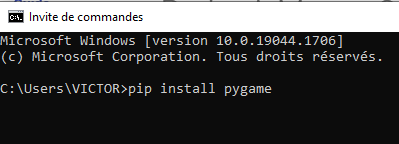
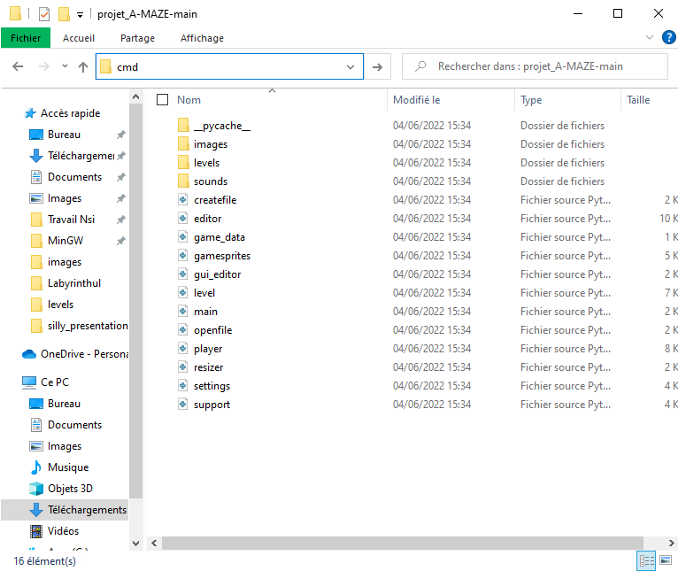
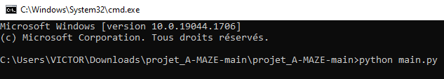

# Projet A-Maze - Guide d'utilisation

## Prérequis

A-Maze est un projet informatique écrit en Python à partir du module Pygame. Il a été déposé sur github sous licence libre.

### 1. Installer Python et Pygame

- Si vous n'avez jamais installé Python, vous devez l'installer à partir du [site officiel](https://www.python.org/downloads/).

- Une fois Python installé, il faut utiliser pip pour installer la librairie Pygame :

<figure markdown>
  
  <figcaption>Installation Pygame à partir du terminal</figcaption>
</figure>

### 2. Installer le projet A-MAZE

- Direction le [dépôt github](https://github.com/victorminator/projet_A-MAZE) où se situe le projet
- Cliquer sur **code** puis sur **download zip**
- Il ne reste plus qu'à extraire le contenu du fichier zip téléchargé

### 3. Exécuter les programmes

- Ouvrir un terminal dans le répertoire où se situe les fichiers _main.py_ et _editor.py_. Si vous êtes sur Windows, il existe un moyen rapide de faire ceçi. Cliquez sur la barre de navigation, effacez le contenu, tapez cmd puis faites _Entrée_ comme illustré ci-dessous :

<figure markdown>
  
  <figcaption>Ouvrir un terminal dans un répertoire sur Windows</figcaption>
</figure>

- Dans le terminal tapez la commande ```python main.py``` pour lancer le jeu ou ```python editor.py``` pour lancer l'éditeur de niveau.

<figure markdown>
  
  <figcaption>Exécuter le fichier main.py avec le terminal</figcaption>
</figure>
Il faut également installer la librairie PySimpleGUI. Pour ce, procédez de la même manière qu'avec l'installation de Pygame.
Et voilà ! Vous pouvez enfin profiter de l'expérience **_A-MAZE_**.

## Gameplay

A-Maze est un jeu de labyrinthe divisé en plusieurs niveaux. A chaque niveau, vous incarnerez un(parfois même plusieurs !) cube qui doit se diriger vers la sortie du labyrinthe, symbolisée par une porte. Mais prenez garde ! Certains de ses cubes se comportent de manière inattendue. Et les fantômes n'hésiterons pas à vous jouer un mauvais tour...
Récupérez rapidement toutes les clés puis empressez-vous vers la sortie. Afin de contrôler votre cube, vous utiliserez simplement les flèches directionnelles de votre clavier.

## Créez vos propres niveaux !

### 1. Présentation et fonctionnement
A-Maze comprend un éditeur de niveau permettant soi-même de construire ses propres niveaux. L'éditeur fonctionne comme l'application _Microsoft Paint_, c'est-à-dire qu'il faut cliquer sur l'élément que vous souhaitez utiliser et maintenir le clic pour continuellement placer l'élément sélectionné.

### 2. Contraintes à respecter

Le jeu n'est pas en mesure de gérer efficacement les cas suivants :

- Plus d'1 porte est présente dans le niveau
- Un des blocs formant le contour du niveau a été remplacé par un autre élément
- Le fantôme est dans l'incapacité de se déplacer où que ce soit

### 3. Précision sur les fantômes

Il existe deux types de fantômes :

- Les fantômes verticaux qui se déplacent de haut en bas. Ils ont subi une rotation et leurs flèches pointent vers le haut et le bas sur l'éditeur.
- Les fantômes horizontaux qui se déplacent de gauche à droite. Leurs flèches pointent vers la gauche et la droite sur l'éditeur pour les différencier de l'autre type de fantôme.

Faites attention à ne pas créer trop de chemins impraticable à cause de fantômes.

### 4. Sauvegarde du niveau

Votre niveau est automatiquement sauvegardé sous la forme d'un fichier _mznv_, format de fichier créé spécialement par l'équipe A-MAZE, lorsque vous quittez l'éditeur. Vous pouvez utiliser la croix rouge pour fermer l'éditeur tout comme vous pouvez appuyez sur la touche _s_.

### 5. Intégrer le niveau dans le jeu

Il suffit de déplacer le fichier _mznv_ créé dans le répertoire **levels**. Attention au nom que vous donnez à votre niveau ! Car l'ordre des niveaux dans le jeu est défini par l'ordre alphabétique des noms de fichier. Si par exemple le fichier portant le nom alphabétiquement plus grand se nomme "12", alors il est conseillé de nommer le fichier que vous souhaitez intégrer "13".

### 6. Envoyez vos niveaux aux responsables du projets

Vous pouvez nous envoyer les niveaux que vous avez créé à l'adresse suivante : [pottier.victor@outlook.fr](mailto:pottier.victor@outlook.fr).
Nous apprécierons beaucoup votre participation à l'embellissement du projet A-Maze :) 
